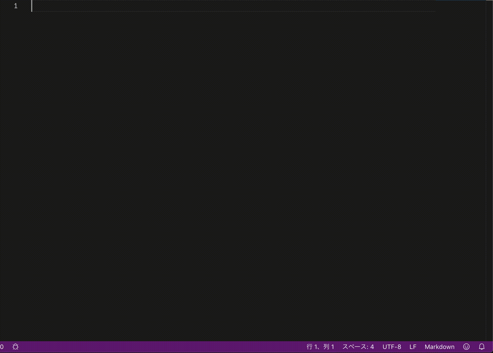

# progman

[JP README](./README.md)

## WHAT

- Display the progress rate of TODO in Markdown file

## WHY

- Trello and Boostnote have a function to display the progress rate and felt it was convenient.

## HOW TO USE

- If you have progman installed, nothing will happen!!
- If you open or edit a markdown file that contains TODO notation, you should see the progress in the lower right.

## DEMO

